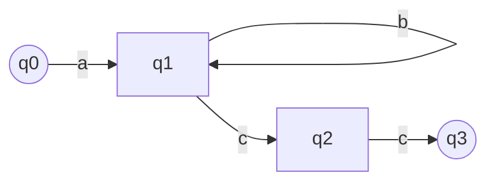
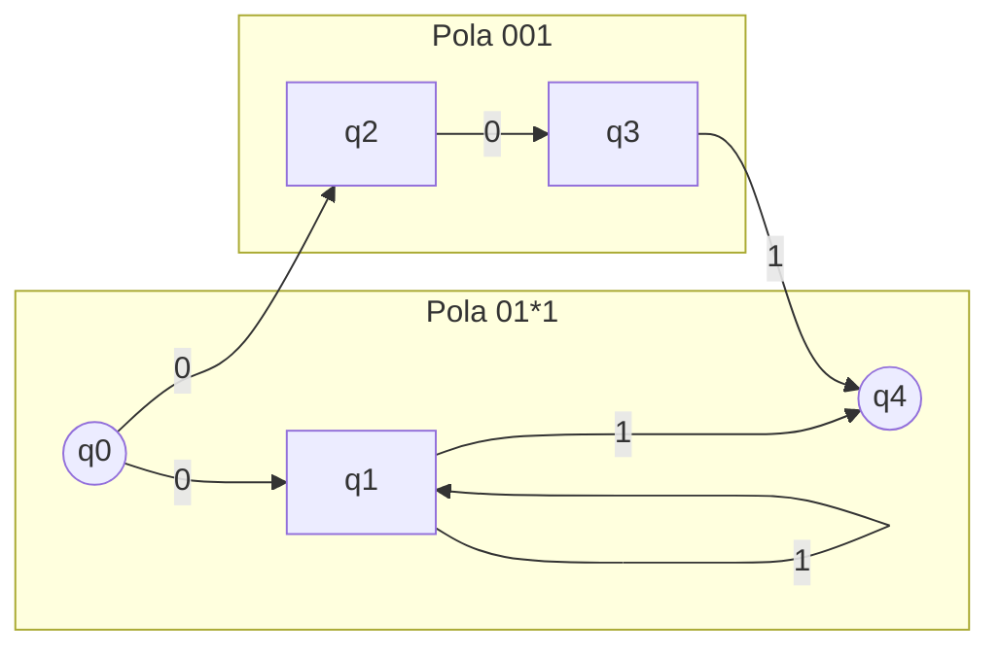
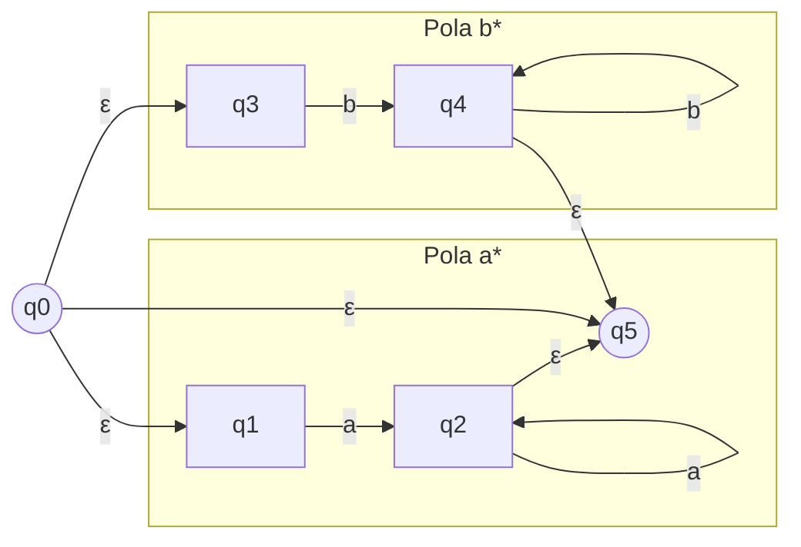
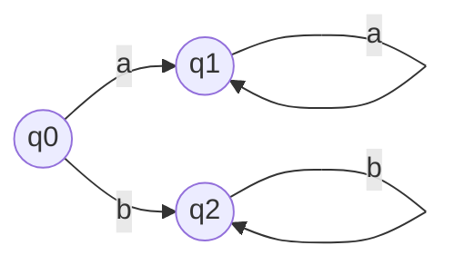

# Latihan 5: Konversi Ekspresi Reguler (ER) ke Finite State Automata (FSA)

Berikut adalah pengerjaan soal latihan 5 berdasarkan metode konstruksi NFA yang dijelaskan dalam materi.

## a. ER = ab*cc

Ekspresi ini merupakan gabungan dari konkatenasi (urutan) dan star (perulangan).
- `a` diikuti oleh
- `b*` (nol atau lebih `b`) diikuti oleh
- `c` diikuti oleh
- `c`

Mesin FSA-nya dapat digambarkan sebagai berikut:

**Penjelasan:**
1.  Mulai dari state awal `q0`.
2.  Membaca input `a` akan berpindah ke state `q1`.
3.  Di state `q1`, mesin bisa terus membaca input `b` dan tetap di state `q1` (ini untuk bagian `b*`).
4.  Dari state `q1`, jika mendapat input `c`, mesin akan berpindah ke `q2`.
5.  Dari `q2`, jika mendapat input `c` lagi, mesin akan berpindah ke state akhir `q3`.

---

## b. ER = 01*1 U 001

Ekspresi ini adalah `union` (gabungan) dari dua buah ekspresi: `01*1` dan `001`. Artinya, mesin akan menerima untai jika sesuai dengan salah satu dari dua pola tersebut.

Mesin FSA-nya dapat digambarkan sebagai berikut:

**Penjelasan:**
- Dari state awal `q0`, ada dua kemungkinan transisi untuk input `0`.
1.  **Jalur Atas (01\*1):**
    - Membaca `0` ke `q1`.
    - Membaca nol atau lebih `1` (loop di `q1`).
    - Membaca satu `1` terakhir untuk mencapai state akhir `q4`.
2.  **Jalur Bawah (001):**
    - Membaca `0` ke `q2`.
    - Membaca `0` lagi ke `q3`.
    - Membaca `1` untuk mencapai state akhir `q4`.

---

## c. ER = a* U b*

Ekspresi ini adalah `union` dari `a*` (nol atau lebih `a`) dan `b*` (nol atau lebih `b`). Ini berarti mesin menerima untai yang hanya terdiri dari `a` saja, atau `b` saja, termasuk untai kosong (ε).

Mesin FSA-nya dapat digambarkan sebagai berikut:

**Penjelasan Sederhana (tanpa ε-move):**
Karena untai kosong (ε) diterima, state awal `q0` juga merupakan state akhir.

**Penjelasan:**
1.  State awal `q0` juga merupakan state akhir untuk menerima untai kosong.
2.  **Jalur `a*`:** Dari `q0`, jika mesin membaca `a`, ia pindah ke state akhir `q1`. Di `q1`, ia bisa terus membaca `a` sebanyak apapun.
3.  **Jalur `b*`:** Dari `q0`, jika mesin membaca `b`, ia pindah ke state akhir `q2`. Di `q2`, ia bisa terus membaca `b` sebanyak apapun.
